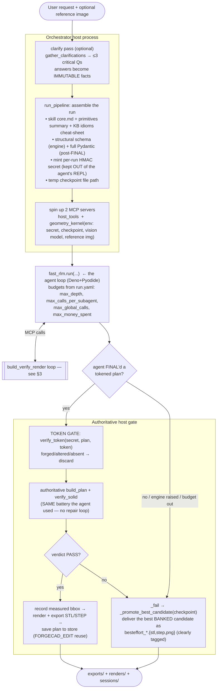
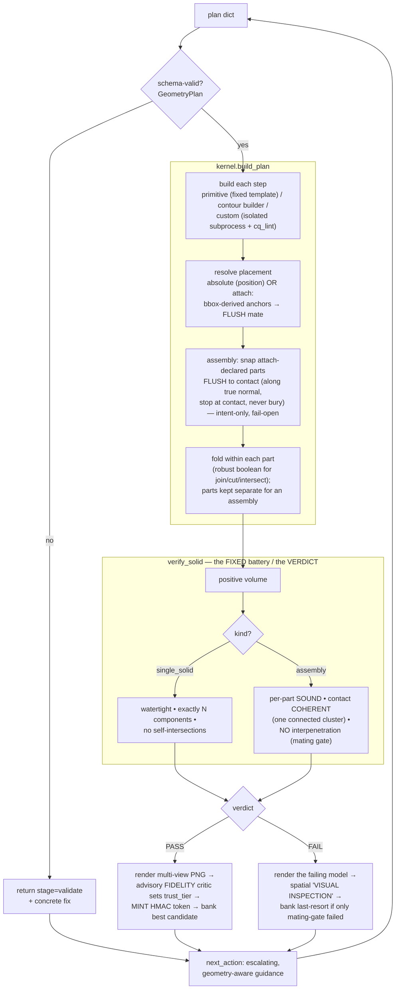
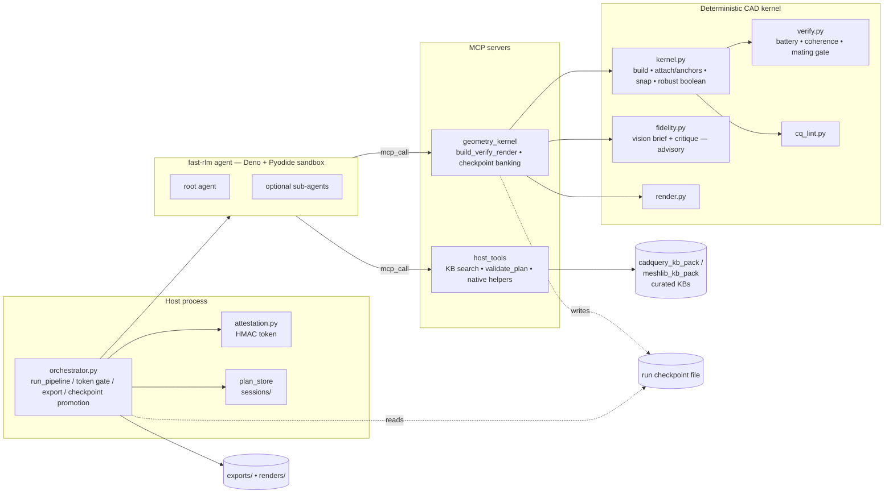

# ForgeCAD — an autonomous "text/image → manufacturable 3D model" agent

ForgeCAD turns a natural-language request (optionally + a reference image) into a **geometrically
sound, verified, manufacturable CAD model** — STL + STEP + a multi-view render + the saved plan. It
runs a recursive-LLM agent ([fast-rlm](https://github.com/google/fast-rlm), a Deno + Pyodide engine)
that drafts a plan and **proves it by building and verifying it itself**, against a deterministic
host-side CAD kernel (CadQuery / OCP + MeshLib) exposed over MCP.

> **The one idea behind everything here:** you cannot make a stochastic LLM reliable by instructing
> it harder. Put the exact geometry and the rules in trusted **host code and gates**, give the agent
> fast, actionable feedback, and **guarantee the system always delivers the best sound result** —
> regardless of how the agent behaves. The agent **proposes**; the host **builds, grades, and
> guarantees**. The agent never runs CAD itself (CadQuery isn't importable in its sandbox).

This README is the team's map of the whole system. The blow-by-blow history of every failure mode we
hit and how we fixed it (with real-run evidence) lives in **`fix.md`** — read it alongside this.

---

## Table of contents
1. [The 30-second mental model](#1-the-30-second-mental-model)
2. [A single session, end to end](#2-a-single-session-end-to-end)
3. [The in-loop build→verify→render cycle (the heart)](#3-the-in-loopbuildverifyrender-cycle-the-heart)
4. [Component & data-flow map](#4-component--data-flow-map)
5. [Capability tiers — how far the agent climbs](#5-capability-tiers--how-far-the-agent-climbs)
6. [The reliability architecture (every guarantee)](#6-the-reliability-architecture-every-guarantee)
7. [Project layout](#7-project-layout)
8. [Setup & run](#8-setup--run)
9. [Tests](#9-tests)
10. [The honest boundary — what to expect](#10-the-honest-boundary--what-to-expect)

---

## 1. The 30-second mental model

- A **plan** is a `GeometryPlan` (Pydantic): a title, dimensions, requirements, and a
  `primitives_sequence` of build steps. Each step is a **certified primitive**, a **contour builder**,
  a **modifier verb** (`fillet`/`chamfer`/`shell`), or a **`custom`** CadQuery step.
- Parts are placed **relationally** (`attach`: mate this part's face to another's so they touch by
  construction) or **absolutely** (`position` — only for genuinely free-floating bodies).
- An object is either a **`single_solid`** (one fused, connected body) or an **`assembly`** (several
  parts that stay separate but TOUCH to form one coherent object). Assembly-by-contact is the default
  for anything multi-part (a chair, a gearbox, a lamp). A `single_solid` may also carry a fused
  **radial/linear `pattern`** of a feature (an impeller hub + N blades, a gear + teeth) — the kernel
  fuses all the copies into one connected body.
- The host **builds** the plan deterministically, runs a **fixed verification battery** (sound +
  coherent + cleanly mated), **renders** it, and an advisory **vision critic** grades the form.
- A plan only "counts" if it carries an **unforgeable token** that could only come from a genuine
  host PASS. The orchestrator re-checks everything, exports, and — crucially — **always delivers the
  best sound model it ever saw**, even if the agent crashes or never finishes.

---

## 2. A single session, end to end

What actually happens when you run `python orchestrator.py` and type a request. Function names refer
to `orchestrator.py`.



**Step by step:**

1. **Clarify (optional, `clarify: true`).** A short pre-pass (`gather_clarifications`) asks ≤3
   critical questions (GUI or terminal). The answers are owned by the orchestrator and applied
   **after** the token gate, so they are immutable facts the agent cannot edit away to game a check.
2. **Assemble the run (`run_pipeline`).** Builds the agent's instructions (the `task_instructions`
   build contract + `role_instructions` = `skills/core.md` + a generated primitives summary + a
   KB-generated **verified-idioms cheat-sheet**), loads the schema (a light *structural* schema for
   the engine; the full `GeometryPlan` Pydantic is enforced after FINAL), and mints a **per-run HMAC
   secret**. The secret is injected **only** into the `geometry_kernel` server's env and this host
   process — never into the agent's REPL — so a token cannot be forged.
3. **Wire two MCP servers.** `host_tools` (planning helpers, KB search, `validate_plan`) and
   `geometry_kernel` (the deterministic CAD kernel: `build_verify_render`, checkpoint banking, the
   host-side fidelity critic). The kernel server's env also carries the checkpoint-file path, the
   vision model name, and the reference image (if any).
4. **Run the agent (`fast_rlm.run`).** The agent drives its OWN stateful build→verify loop (§3) and
   self-governs termination. There is no host retry count; budgets in `run.yaml` are the hard ceiling
   (`max_calls_per_subagent: 50`, `max_global_calls: 150`, `max_money_spent: 1.00`, `max_depth: 1`).
5. **Token gate.** When the agent FINALs a plan, the orchestrator pops the `verification_token` and
   calls `attestation.verify_token`. No valid token (never built, or altered after verifying) →
   the FINAL is discarded.
6. **Authoritative gate.** The orchestrator runs **one** `kernel.build_plan` + `verify_solid` with
   the same battery the agent used (no repair loop — the agent already converged). It records the
   **measured** bounding box into the plan (the size is an emergent OUTPUT the kernel owns).
7. **Export.** On PASS: render the multi-view PNG, export STL + STEP to `exports/`, and save the
   accepted plan to `sessions/` (reuse with `FORGECAD_EDIT=<id|latest>`).
8. **Guaranteed delivery.** On ANY non-clean exit — no token, authoritative FAIL, or the engine
   *raising* because the agent ran out of budget without a FINAL — `_fail` calls
   `_promote_best_candidate(checkpoint)` to promote the best **banked** candidate as a clearly-tagged
   `besteffort_*` artifact. A run can never yield nothing when a sound model existed at any point.

**Concrete example — the office-chair run `logs/geometry_planning_2026-06-27T00-39-34-929Z.jsonl`:**
the agent read the schema + tools, tested `swept_circle` and an attach offset in isolation, then
assembled a 22-part chair (`assembly_kind='assembly'`, every part placed by `attach`: hub → 5 legs →
5 casters → gas-lift → mechanism box → seat → backrest spine/cushion → 2 armrests → headrest). Its
first full assembly FAILED coherence (the backrest cluster floated). It revised, the kernel **snapped**
8 parts into contact, the verdict went **PASS** (`trust_tier: needs_review` — the vision critic flagged
it as blocky but that's advisory and never blocks), it embedded the returned token and **FINAL'd** —
36 steps, well inside budget. That run pre-dated the **mating gate** (§6); the render showed the
backrest *dug into* the seat. With the mating gate + flush snap + flush anchors now in place, that
burial would **FAIL** `no_interpenetration` with an actionable fix, and the flush snap would seat the
parts cleanly instead of shoving them 16–22 mm into each other.

---

## 3. The in-loop build→verify→render cycle (the heart)

Every iteration the agent calls `build_verify_render(plan)` on the `geometry_kernel` MCP server.
Inside the host (`cad_kernel/geometry_server.py::_build_verify_render_impl`):



- **Schema validate first.** The same `GeometryPlan` contract the FINAL gate uses runs in-loop, so a
  plan that would "pass geometry" but be un-FINAL-able is rejected early with the concrete cause.
- **Build (`kernel.build_plan`).** Primitives build from fixed templates in `schemas/primitives.json`
  (no code generation). `custom` steps run their `code_sketch` in an **isolated subprocess** with a
  timeout, gated by a fast `cq_lint` that catches invented methods in milliseconds.
- **Placement.** `attach` anchors (`at`/`my_anchor` = `top`/`bottom`/`left`/`right`/`front`/`back`,
  edges `top|front`, corners `top|front|right`, or `center`) are resolved from each part's **bounding
  box**, so a face mate is **flush for any primitive and any rotation**. `attach.offset` slides a part
  *across* the mating face (in-plane) and can never lift it off the mate; `gap` spaces along the
  normal.
- **Flush snap (assemblies).** A part that DECLARED `attach.to` a target but drifted is translated
  along the **true contact normal** by exactly the surface gap (MeshLib closest points) until the
  surfaces touch — it **stops at contact and never buries**. Intent-only (absolute-position parts are
  never moved) and fail-open.
- **Verify (`verify_solid`).** The human-authored, deterministic battery the agent does NOT get to
  choose or skip. `single_solid` → watertight + exact component count + no self-intersection + **no
  silently-dropped body** (a fused result can't be smaller than its largest additive body minus what
  cuts remove). `assembly` → every part sound on its own, the parts forming ONE contact-connected
  cluster, AND the **mating gate** (no part substantially buried in another). If the user stated an
  explicit dimension, a **`size_envelope`** gate also fails a grossly oversized model.
- **Render + fidelity.** On geometry PASS the solid is rendered (matplotlib multi-view with a labeled
  X/Y/Z triad) and an advisory vision critic grades the form against the **immutable** intent (the
  user's prompt + clarifier answers + the reference image if provided, OR a text **form brief** the
  host reasons from the prompt when no image is given). It sets `trust_tier` and gives actionable
  feedback — it **never** blocks the token.
- **Token + checkpoint.** A geometry PASS mints the HMAC token and banks the candidate to the run
  checkpoint. `next_action` is escalating and geometry-aware (it names the disconnected part, the
  missing feature, the interpenetrating pair, or what the snap moved).

---

## 4. Component & data-flow map



The agent only ever holds a **plan dict** and **`build_verify_render` results**. The signing secret,
the immutable intent, and the vision credentials live in the kernel server's env and the host — never
in the agent's REPL.

---

## 5. Capability tiers — how far the agent climbs

The agent should use exactly as much machinery as the object needs — no more.

| Tier | Mechanism | When it engages |
|------|-----------|-----------------|
| **1. Certified primitives** | `box`, `cylinder`, `sphere`, `lofted_box`, `swept_circle`, `filleted_box`, … built from fixed templates | Default. Covers most parts. No CadQuery code, no KB. |
| **2. Contour builders** | `lofted_sections`, `swept_profile`, `revolved_profile`, `twisted_loft` (a profile lofted through `[z,radius,twist_deg,scale]` stations → blades/vanes/augers/twisted columns) (+ `fillet`/`chamfer`/`shell` modifier verbs) | When a part needs a contour/taper/sweep/twist but is still parameterizable. Still host-built. |
| **3. `custom` step (+ KB + lint)** | Hand-written CadQuery `code_sketch`, grounded by the KB cheat-sheet + `cadquery_search`/`cadquery_doc`, gated by `cq_lint` | Only when **no** primitive/verb fits. The KB matters **only here** — it grounds freeform code. Custom ships `needs_review`. |
| **4. Sub-agents** | The agent spawns children (`llm_query`/`batch_llm_query`) to explore strategies in parallel or decompose a big problem | The agent's **own decision**. `max_depth: 1` permits one level of children. A child doing geometry must be granted `mcp=['geometry_kernel','host_tools']` (children inherit none) so it can self-verify. |

**Why a given run may not touch Tiers 3–4 (and that's correct):** a 22-part chair built entirely from
Tier-1/2 primitives never needs `custom`, so it never consults the KB or triggers the lint; and a
moderate, linearly-decomposable object doesn't need to fan out sub-agents. Those tiers are held in
reserve for harder objects. **Spawning is deliberately the agent's call** — forcing it would be
prompt-tuning the stochastic agent's behavior, and the system's reliability must never depend on it.

---

## 6. The reliability architecture (every guarantee)

These are the host-side gates that make the system trustworthy regardless of how the agent behaves.

- **Fixed verification battery (the verdict).** Human-authored, deterministic, identical on every
  solid. The generator never grades itself. A PASS means **SOUND + RIGHT-SIZED + CLEANLY MATED**, not
  "the right object."
- **Unforgeable token.** A run yields a result only if the plan carries an HMAC token that could only
  come from a genuine `build_verify_render` PASS for **that exact plan**. The token hashes the
  **geometry-only projection** of the schema-normalized plan — `assembly_kind` + each step's build
  fields (`primitive_type`/`parameters`/`operation`/`position`/`rotation`/`attach`/`pattern`/`part`/
  `name`). Pinning only the geometry means a genuinely-verified plan survives ALL the benign edits the
  agent makes before FINAL — representational noise (`int`↔`float`, key order, a derived field like
  `contains_freeform`, a re-serialization) AND descriptive-metadata edits (a reworded `title`, an
  added `assumption`/`clarification`, an edited requirement or `rationale`) — while a real geometry
  change is still rejected. The secret never reaches the agent; no genuine pass → no token →
  discarded. (Fail-safe: if a plan can't be normalized, it falls back to the raw geometry projection.)
- **No silently-dropped body (monolithic fusion).** The boolean combine is **volume-monotonic** (a
  union can never shrink below its largest operand) and escalates to a shape-level fuse; a verify
  **`no_dropped_body`** invariant FAILs a fused `single_solid` that lost an additive body. So an
  impeller's hub + N blades fuse into ONE connected body or fail loudly — never a silent
  blade-only result.
- **`attach` is a host-enforced FLUSH contact guarantee.** Anchors are bounding-box-derived (flush for
  any shape/rotation); a drifted attach part is snapped along the true contact normal until the
  surfaces touch, stopping at contact (never buried). Absolute-`position` parts are never moved, so a
  genuinely misplaced part still surfaces as an error. `attach.to` accepts a step `name`/`id` **or a
  `part`-group name** (a multi-step part), so the agent can mate to "the backrest" without naming a
  sub-step.
- **Mating-quality gate (no "dug inside").** For every overlapping pair the host measures the
  intersection **volume** and classifies it by the containment ratio `c = V∩ / min(volA, volB)`:
  flush contact (≈0) and small **joint/convergence** overlaps (`c ≤ 0.2`, e.g. radial spokes meeting a
  hub) and **intended insertions** (`c ≥ 0.75`, e.g. peg-in-hole, telescoping, an embedded spine) are
  ALLOWED; a part **substantially buried** in another (mid-band) is a hard `no_interpenetration`
  FAIL. All volume math is fail-open. Tunable: `FORGECAD_CONTAINMENT_RATIO` /
  `FORGECAD_OVERLAP_MINOR_FRAC` / `FORGECAD_OVERLAP_FLOOR`.
- **Assembly-by-contact is the default for multi-part objects.** Parts that *touch* (`operation:'new'`
  + `attach`) need no boolean fuse — coherence is verified by contact. `join`/`cut` (fuse) is reserved
  for a single monolithic body.
- **Robust boolean combine.** The fuses that remain go through one healing + escalating-fuzzy-tolerance
  wrapper; a genuine failure raises a structured, design-level error (not a raw OCC `Null TopoDS_Shape`).
- **Robust swept construction + specific diagnostics.** Swept parts (`swept_circle`/`swept_profile`)
  build through a helper that prefers a mesh-sound candidate (rounded transition / light corner-round),
  faithful-first so a good sweep is never regressed and an alternative is used only if it is sound. A
  genuinely ill-posed sweep/loft/revolve (a cross-section fatter than its turn — which no corner
  treatment can fix) FAILs with a **specific** cause + fix ("reduce the radius / lengthen the path"),
  not a raw self-intersection count.
- **Advisory fidelity + trust tiers.** The vision critic grades whether the model *looks right* (against
  the request and any reference image) and sets `trust_tier` (`certified` vs `needs_review`). It never
  blocks a sound model — a blocky-but-sound model ships as `needs_review`.
- **Front-of-pipeline robustness (works for any user, with or without an image).** With **no reference
  image** the host reasons a text **form brief** from the prompt (the multimodal model in text mode) and
  judges the render against it, so a no-image run is guided as well as a with-image one (the with-image
  path is unchanged). The **clarifier** asks only the non-negotiables (overall size, count of the main
  feature, critical orientation/mounting, geometry-changing material) in plain language with concrete
  examples + a "not sure / use standard defaults" escape — usable by technical and non-technical users —
  and vague answers normalize to a recorded default. An **explicit user-stated dimension** is enforced
  by a deterministic **`size_envelope`** gate (a gross-oversize FAILs), while emergent proportion stays
  advisory.
- **Best-candidate checkpoint ("never deliver nothing").** Every host-verified candidate is banked,
  ranked **fidelity-pass (2) > sound+coherent (1) > sound-but-interpenetrating last-resort (0.5)**. The
  last-resort rank means even a model that only fails the mating gate is still deliverable (never
  token-minted, always `needs_review`) while the agent works toward a flush version. At run end — on
  success, rejection, budget exhaustion, or the engine raising — the orchestrator promotes the best
  banked candidate as a clearly-tagged best-effort artifact.
- **API-grounded custom code.** A compact KB-generated cheat-sheet (verified op list + selector grammar
  + a live-verified "these methods do NOT exist" list) plus a fast pre-build `cq_lint` keep
  hand-written CadQuery from hallucinating; the full KB is a lazy lookup.
- **Bounded context.** The injected instructions are compacted and front-load a build-first START-HERE
  block, so the agent's budget goes to building, not re-reading itself (a regression cap test guards it).

---

## 7. Project layout

*   [orchestrator.py](file:///Users/makumar/Documents/forgecad_v5/orchestrator.py) — entry point: clarify → `run_pipeline` (assemble query + skill + MCP servers → run the agent → token gate → authoritative build/verify → export → checkpoint delivery).
*   [run.yaml](file:///Users/makumar/Documents/forgecad_v5/run.yaml) — model + budgets, generation params, `skill`/`schema`/`clarify` flags.
*   [plan_store.py](file:///Users/makumar/Documents/forgecad_v5/plan_store.py) — handles saving/loading plans from `sessions/`.
*   [trace_view.py](file:///Users/makumar/Documents/forgecad_v5/trace_view.py) — renders the agent trace from JSONL logs.
*   [ui_server.py](file:///Users/makumar/Documents/forgecad_v5/ui_server.py) — minimal test UI server.
*   [README.md](file:///Users/makumar/Documents/forgecad_v5/README.md) — canonical docs (this file).
*   [fix.md](file:///Users/makumar/Documents/forgecad_v5/fix.md) — the full, evidence-backed history of every failure mode and its fix.
*   📂 [cad_kernel/](file:///Users/makumar/Documents/forgecad_v5/cad_kernel/) — the deterministic host engine:
    *   [kernel.py](file:///Users/makumar/Documents/forgecad_v5/cad_kernel/kernel.py) — `build_plan`; primitives/contours/custom; `_anchor_point`; `attach` resolution; `_robust_boolean`; `_rotate_vec`.
    *   [verify.py](file:///Users/makumar/Documents/forgecad_v5/cad_kernel/verify.py) — `verify_solid` (the battery), `verify_assembly_coherence`, `snap_assembly_to_contact`, the MeshLib bridge.
    *   [fidelity.py](file:///Users/makumar/Documents/forgecad_v5/cad_kernel/fidelity.py) — vision brief/critique (advisory) and text **form brief** reasoning.
    *   [render.py](file:///Users/makumar/Documents/forgecad_v5/cad_kernel/render.py) / [attestation.py](file:///Users/makumar/Documents/forgecad_v5/cad_kernel/attestation.py) / [geometry_server.py](file:///Users/makumar/Documents/forgecad_v5/cad_kernel/geometry_server.py) / [cq_lint.py](file:///Users/makumar/Documents/forgecad_v5/cad_kernel/cq_lint.py).
*   📂 [schemas/](file:///Users/makumar/Documents/forgecad_v5/schemas/)
    *   [geometry_plan.py](file:///Users/makumar/Documents/forgecad_v5/schemas/geometry_plan.py) — the `GeometryPlan` Pydantic contract.
    *   [primitives.json](file:///Users/makumar/Documents/forgecad_v5/schemas/primitives.json) — the single source of truth for primitive templates.
*   📂 [skills/](file:///Users/makumar/Documents/forgecad_v5/skills/)
    *   [core.md](file:///Users/makumar/Documents/forgecad_v5/skills/core.md) — the agent's planning rules.
*   📂 [tools/](file:///Users/makumar/Documents/forgecad_v5/tools/) — host MCP tools + native helpers.
*   📂 [cadquery_kb_pack/](file:///Users/makumar/Documents/forgecad_v5/cadquery_kb_pack/) & 📂 [meshlib_kb_pack/](file:///Users/makumar/Documents/forgecad_v5/meshlib_kb_pack/) — curated KBs + retrieval tools.
*   📂 [docs/](file:///Users/makumar/Documents/forgecad_v5/docs/) — historical dev notes, phase changelogs (`CHANGES_*.md`), and reference documents.
*   📂 [scripts/](file:///Users/makumar/Documents/forgecad_v5/scripts/) — standalone dev utilities (`parse_log.py`, `split_stl.py`, `test_fix.py`).
*   📂 [tests/](file:///Users/makumar/Documents/forgecad_v5/tests/) — the regression suite (each fix has a deterministic test).

---

## 8. Setup & run

```bash
python3 -m venv .venv && source .venv/bin/activate
pip install -r requirements.txt          # CadQuery/OCP, MeshLib, matplotlib, mcp, fast-rlm, ...
# Deno is required by fast-rlm: curl -fsSL https://deno.land/install.sh | sh
echo 'RLM_MODEL_API_KEY="your-gemini-api-key"' > .env   # AIzaSy.../AQ. → routed to Google AI Studio
```

Set the latest capable model in `run.yaml` (`primary_agent`/`sub_agent`); the same model powers the
host-side vision brief + design critic (`FORGECAD_VISION_MODEL` is derived from it).

```bash
python orchestrator.py        # CLI: enter a request; answer clarifier questions; watch the loop
python ui_server.py           # minimal test UI: prompt + optional reference image, polls /status
```

Outputs land in `exports/` (STL/STEP), `renders/` (PNG), and the accepted plan in `sessions/`
(reuse next time with `FORGECAD_EDIT=<id|latest>`). Logs stream to `logs/*.jsonl`
(`python trace_view.py logs/<file>.jsonl` renders the agent trace). Best-effort deliveries are named
`besteffort_<title>.{stl,step,png}`.

Useful env knobs: `FORGECAD_CONTACT_EPS` (contact tolerance, default 0.5 mm), the mating-gate trio
above, `FORGECAD_CHECKPOINT_FILE` (set by the orchestrator per run), `FORGECAD_REFERENCE_IMAGE`,
`FORGECAD_SIZE_CONSTRAINT` (auto-set from an explicit user-stated dimension → the `size_envelope` gate).

---

## 9. Tests

```bash
export PRIMITIVES_JSON_DATA="$(cat schemas/primitives.json)"; export PYTHONPATH="$(pwd)"; export RLM_MODEL_API_KEY=dummy
for t in tests/test_*.py; do .venv/bin/python "$t"; done
```

The suite is **offline and deterministic** (no Deno / no live vision needed) — it locks down the build,
the battery, soundness + coherence + flush contact + the mating gate, **single_solid monolithic fusion
(no silently-dropped body) + radial-patterned fusion + the `twisted_loft` technique**, the **token's
robustness to benign edits incl. descriptive-metadata** (yet rejection of real geometry changes),
**robust swept construction + the specific unsound-geometry diagnostic**, **`attach.to` a part-group
name**, the best-candidate checkpoint delivery (including the no-FINAL engine-raise and the last-resort
interpenetrating rank), robust boolean combine, the API lint, the bounded context, and the
**front-of-pipeline robustness** (text form brief, accessible clarifier, vague-answer normalization,
and the explicit-dimension `size_envelope` gate).

---

## 10. The honest boundary — what to expect

**Deterministic and host-enforced (proven by the offline suite):** the build, the verification
battery, soundness + coherence + `attach` **flush** contact, **no interpenetration** (intended
insertions allowed), **single_solid monolithic fusion with no silently-dropped body**, the
**geometry-only token**, the best-candidate checkpoint delivery (incl. when the engine raises
and the last-resort rank), robust boolean combine, the API lint, the bounded context, and — when the
user states an explicit dimension — the **`size_envelope`** gate. **A run can no longer build a sound
model and then deliver nothing, it can no longer ship parts buried into each other, and a fused part
can no longer silently lose a body.**

**Perceptual and NOT bit-repeatable (needs the live machine: Deno + a real vision endpoint + a valid
`FORGECAD_VISION_MODEL`):** whether a delivered model is *judged* `certified` vs `needs_review`, and
how closely it matches a reference's refinement. That judgment only **grades and guides** — it can
never turn a real, sound, buildable result into nothing, and never blocks the token.

**Explicitly NOT verified (know this when you rely on output):** *functional/physical truth* —
`engineering_requirements` (load capacity, gas-lift travel, thermal limits) are recorded as text, not
simulated; the platform proves geometric soundness, not that the object would *function*. And
*emergent proportion* is advisory — an **explicit user-stated dimension** is now enforced by the
`size_envelope` gate, but the overall proportion of a mated assembly is excluded from the token and
only loosely audited, so "right-sized" beyond a stated limit is loose.

In short: expect a **sound, coherent, cleanly-mated, recognizable, delivered** model every time — and
a primitive-built one whose **form realism** and **physical function** are bounded by primitives and
by an advisory critic, not guaranteed. The fast-rlm engine itself is unmodified; every fix is
host-side. The full story is in **`fix.md`**.
