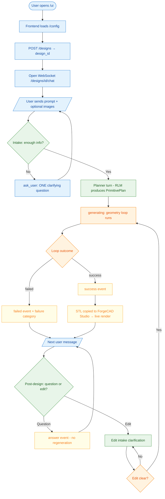

# User Flow

End-to-end user journey through GAH-v2: from opening the UI, through conversational intake and geometry generation, to the post-design question/edit loop.

```mermaid
flowchart TD
    A([User opens /ui]) --> B[Frontend loads /config]
    B --> C[POST /designs → design_id]
    C --> D[Open WebSocket /designs/id/chat]
    D --> E[/User sends prompt + optional images/]
    E --> F{Intake: enough info?}
    F -- No --> G[ask_user: ONE clarifying question]
    G --> E
    F -- Yes --> H[Planner turn - RLM produces PrimitivePlan]
    H --> I[generating: geometry loop runs]
    I --> J{Loop outcome}
    J -- success --> K[success event]
    J -- failed --> L[failed event + failure category]
    K --> M[STL copied to ForgeCAD Studio → live render]
    L --> N[/Next user message/]
    M --> N
    N --> O{Post-design: question or edit?}
    O -- Question --> P[answer event - no regeneration]
    P --> N
    O -- Edit --> Q[Edit intake clarification]
    Q --> R{Edit clear?}
    R -- No --> Q
    R -- Yes --> I
    class A,B,C,D,E,G,N ui
    class F,H,O,Q backend
    class I,J,R runtime
    class K,L,M,P data

    classDef ui       fill:#E3F2FD,stroke:#1976D2,color:#0D47A1;
    classDef backend  fill:#E8F5E9,stroke:#388E3C,color:#1B5E20;
    classDef runtime  fill:#FFF3E0,stroke:#F57C00,color:#E65100;
    classDef tools    fill:#F3E5F5,stroke:#8E24AA,color:#4A148C;
    classDef temporal fill:#FCE4EC,stroke:#C2185B,color:#880E4D;
    classDef external fill:#ECEFF1,stroke:#546E7A,color:#263238;
    classDef data     fill:#FFFDE7,stroke:#F9A825,color:#F57F17;
```
