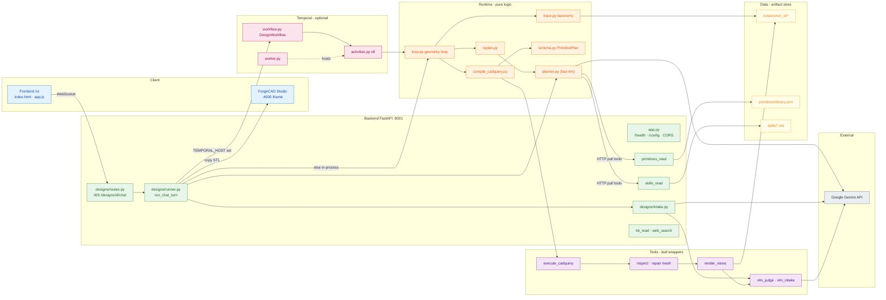

# Technical / Component Architecture

Component and layer map of GAH-v2 showing the frontend, backend services, pure runtime, leaf tools, the optional Temporal layer, external Gemini API, and the artifact data store — including the in-process vs. Temporal execution fork.

