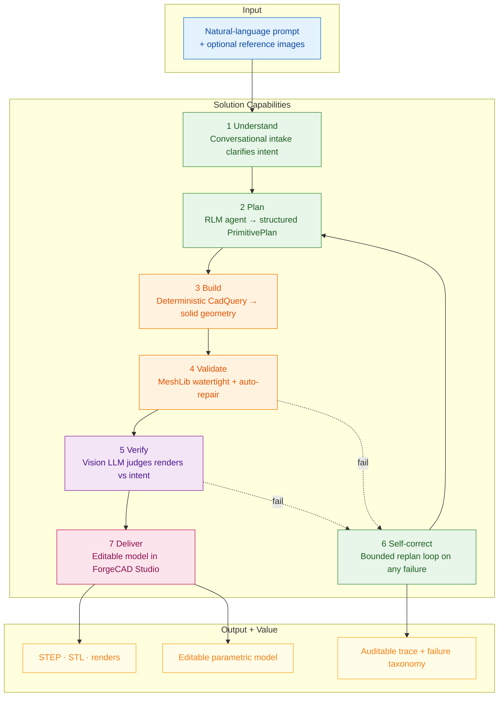

# Solution Architecture

Capability and value chain: how a natural-language prompt flows through the seven solution capabilities (Understand → Plan → Build → Validate → Verify → Self-correct → Deliver) to produce editable, auditable CAD output.

