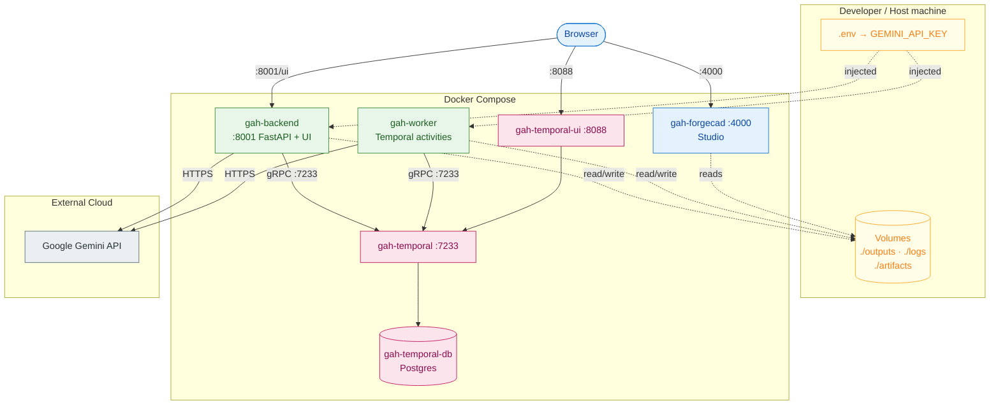

# Enterprise / Deployment Architecture

Docker Compose container topology (milestone M11): backend, worker, Temporal server + Postgres + Web UI, and ForgeCAD Studio — with ports, host volumes, injected secrets, and the external Gemini API.

