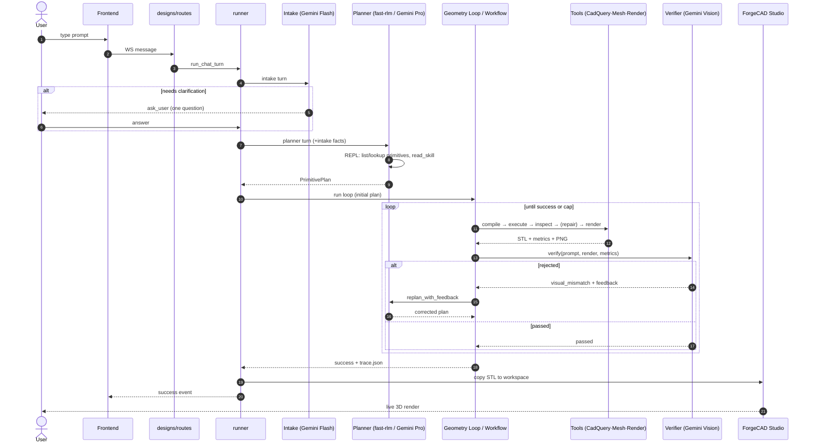

# Sequence: Request → Success

Timeline of a single design request from prompt to a rendered model, including the conversational intake, the RLM planner turn, and the bounded verify/replan loop.

```mermaid
sequenceDiagram
    autonumber
    actor U as User
    participant FE as Frontend
    participant WS as designs/routes
    participant R as runner
    participant I as Intake (Gemini Flash)
    participant P as Planner (fast-rlm / Gemini Pro)
    participant L as Geometry Loop / Workflow
    participant T as Tools (CadQuery·Mesh·Render)
    participant V as Verifier (Gemini Vision)
    participant S as ForgeCAD Studio
    U->>FE: type prompt
    FE->>WS: WS message
    WS->>R: run_chat_turn
    R->>I: intake turn
    alt needs clarification
        I-->>U: ask_user (one question)
        U->>R: answer
    end
    R->>P: planner turn (+intake facts)
    P->>P: REPL: list/lookup primitives, read_skill
    P-->>R: PrimitivePlan
    R->>L: run loop (initial plan)
    loop until success or cap
        L->>T: compile → execute → inspect → (repair) → render
        T-->>L: STL + metrics + PNG
        L->>V: verify(prompt, render, metrics)
        alt rejected
            V-->>L: visual_mismatch + feedback
            L->>P: replan_with_feedback
            P-->>L: corrected plan
        else passed
            V-->>L: passed
        end
    end
    L-->>R: success + trace.json
    R->>S: copy STL to workspace
    R-->>FE: success event
    S-->>U: live 3D render
```
