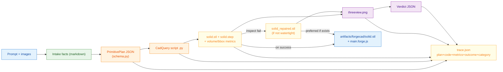

# Data / Artifact Flow

How data transforms through the pipeline: prompt → intake facts → PrimitivePlan → CadQuery script → STL/STEP → (repair) → renders → verdict → trace, with the best STL copied to the ForgeCAD Studio workspace on success.

