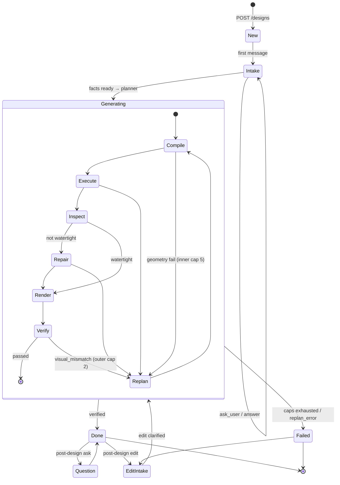

# State Machine: Session + Replan Loop

Design-session lifecycle and the bounded repair loop: the inner cap governs geometry-stage failures (compile/execute/repair) and the outer cap governs visual mismatches, with post-design question and edit transitions.

