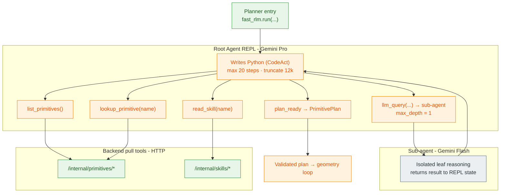

# RLM Recursion Architecture (CodeAct)

How the planner works: a Gemini Pro root agent runs a CodeAct Python REPL, calls HTTP pull tools for primitives and skills, optionally spawns a depth-1 Gemini Flash sub-agent, and emits a validated PrimitivePlan.

