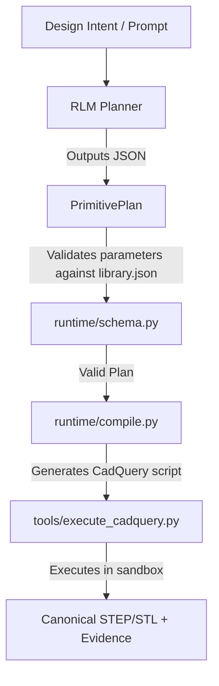

# Geometry Agent Runtime (GRT)

The Geometry Agent Runtime is the pure, state-free execution boundary between language model reasoning and CAD kernel tooling. It handles primitive validation, script compilation, execution measurement, and trace capture.

## Purpose

To prevent the AI agent from writing arbitrary, non-deterministic, or dangerous CAD code directly, GAH-v2 enforces a **semantic primitive contract**:
1. The planner agent generates a structured JSON **`PrimitivePlan`**.
2. The runtime validates this plan against canonical parameter specifications.
3. The runtime compiles this validated plan into standard, execution-safe **`CadQuery`** scripts.
4. The runtime executes the script and collects authoritative 3D geometric evidence.

By isolating geometry generation and measurement from state machines (Temporal) and language models, we ensure repeatability, auditability, and safety.

## Architecture

```
runtime/
├── README.md        # Component overview (this file)
├── schema.py        # Pydantic validation schemas & parameter mapping
└── compile.py       # CSG assembly and CadQuery generator
```

### 1. Schema Validation (`schema.py`)
This module maps and validates primitive plans using Pydantic. It loads the active primitive schemas dynamically from `primitives/library.json` and ensures:
- All parameter names exist for the selected shape.
- Values conform to the expected types (e.g. `float` or `int`).
- Position coordinates `[x, y, z]` and orientation angles `[rx, ry, rz]` are present.
- CSG operations are restricted to `base`, `union`, or `cut`.

### 2. Compilation (`compile.py`)
This module takes a validated `PrimitivePlan` and builds a complete Python script:
- Loads the base template for the designated primitive from the library.
- Formats it with its parameters (e.g., `cq.Workplane("XY").box(10.0, 10.0, 10.0)`).
- Generates code to translate and rotate the resulting solid to the specified position/orientation.
- Stacks the shapes using standard CadQuery boolean methods (`.union()`, `.cut()`) to produce the final `result` object.

## Flow Diagram


